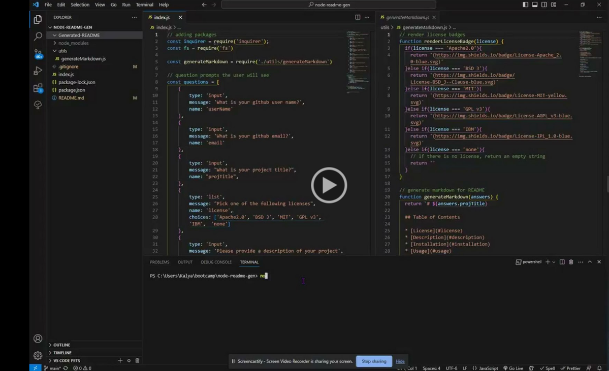

# node-readme-gen

## Usage

Please refer to the provided video for instructions on using this application. When prompted by the terminal you will be asked a series of questions in which you can either input your own information or select from provided contents. Once you see the success message "yay!" your README will display in the Generated README folder.

## Contact

For any questions, please contact me via the channels below:
Github: https://github.com/kaylaasana
E-mail: kayladatte@gmail.com